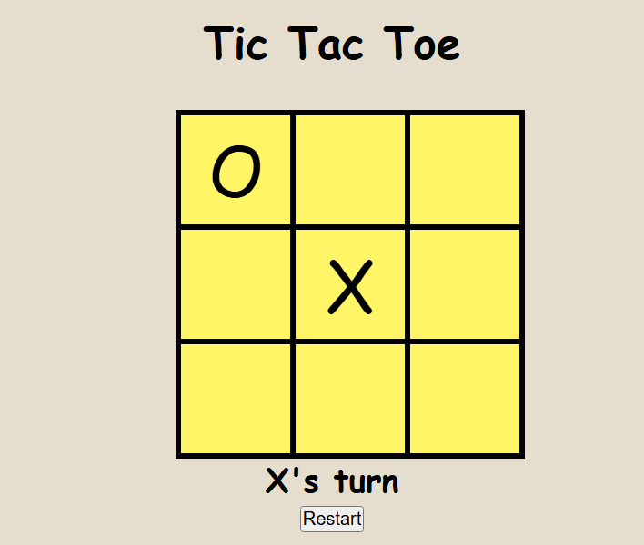

# Tic Tac Toe Game



Simple Tic Tac Toe Game.

## Description

This is a classic Tic Tac Toe game built with HTML, CSS, and JavaScript. Players can take turns on a 3x3 grid, with the goal of getting three of their marks (X or O) in a row—horizontally, vertically, or diagonally. The game will notify the player when there’s a winner or if the game ends in a draw. It’s a fun, interactive game that can be played directly in a web browser.

## Getting Started

### Dependencies

- A modern web browser (e.g., Google Chrome, Firefox, Edge)
- No special libraries or frameworks are required
- Operating system: Windows, Mac, or Linux

### Installing

1. Clone or download the repository to your local machine:

```sh
git clone https://github.com/Ashutosh-88/-Simple--Tic-Tac-Toe-Game
```

2. Navigate to the project folder in your terminal:

```sh
cd -Simple--Tic-Tac-Toe-Game
```

3. Open the `index.html` file in your web browser.

### Executing Program

1. To play the game, simply open the `index.html` file in your browser.
2. The game board will appear, and you can start playing by clicking on the grid.
3. The first player to get three marks in a row wins.
4. If there’s no winner, the game will declare a draw.
5. Click the "Restart" button to start a new game.

## Help

If you run into any issues, ensure you are using a compatible browser and that JavaScript is enabled. If you need more help, please check the browser console for any error messages.

To reset or restart the game, click the "Restart" button located at the bottom of the game board.

## Authors

Contributors names and contact info

- [Ashutosh Tiwari](https://www.linkedin.com/in/ashutosh-tiwari-70b504190/)

## Version History

- 0.1
  - Initial Release

## License

This project is licensed under the [MIT License](https://opensource.org/licenses/MIT) - see the LICENSE.md file for details.

## Acknowledgments

- [@BroCodez](https://www.youtube.com/@BroCodez)
